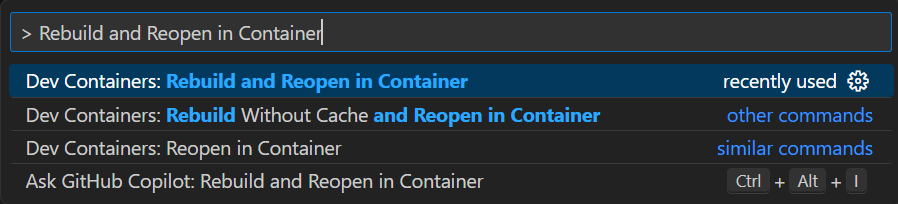
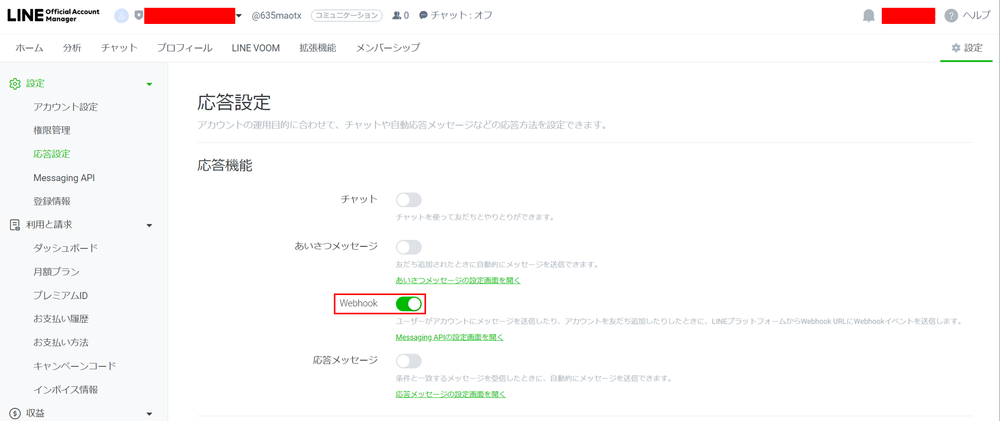
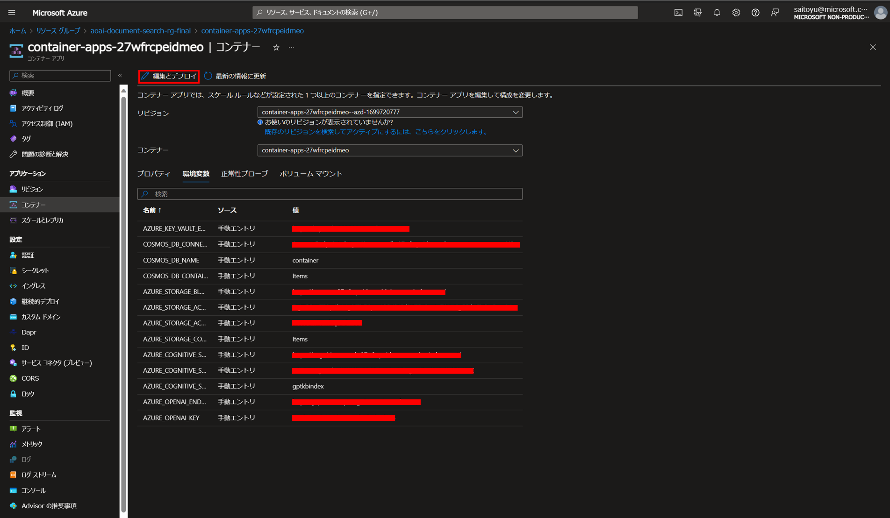

# 手順
本アプリを実行する手順を簡単にまとめます。

## 開発コンテナの立ち上げ
Visual Studio Codeの拡張機能であるDev Containerを用います。
コマンドパレットを立ち上げ、Dockerを起動させた状態で、`Rebuild and Reopen in Container`と入力して実行してください。(コンテナの立ち上がりに約5分程時間がかかります。)



## .envの設定
`.env.sample`を参考にして、`app/backend/.env`と`app/prepdocs/.env`に必要な情報を記載してください。

## KeyVault名の設定
keyVaultNameを他のリソース名と重複しないように命名した後(例：keyvault-<年月日>)、以下の2つのファイルに入力する。
- infra/main.bicepのmodule keyVault 'core/security/keyvault.bicep' > params > name
    - name: 'keyvault-yyyymmdd'
- app/prepdocs/.env
    - AZURE_KEY_VAULT=

## アプリのデプロイ

環境を初期化(Enter a new environment name: で任意の環境名を入力する)
```
azd init
```

Azureにログイン(ブラウザに遷移するため、ブラウザ上でログイン)
```
azd auth login
```

Azureリソースをプロビジョニング(azd provision)と、アプリのデプロイ(azd deploy)
```
azd up
```

## デプロイ後のセットアップ
### LINEのセットアップ
- Line Developerのポータル上でWebhook URLの登録をしてください。登録するURLは`Container AppsのURL+/callback?<?bot_name=ボット名>`です。
- チャネルシークレットとチャネルアクセストークンをコピーしてください。
- Webhookの利用を有効にしてください。

https://developers.line.biz/ja/

(`app/backend/.env`の`PP_LINE_CHANNEL_SECRE`と`PP_LINE_CHANNEL_ACCESS_TOKEN`については、ローカルでのデバッグを行う場合に設定が必要になります。)

### Container Appsの環境変数の設定
Azureポータルから、コピーしたチャネルシークレットとチャネルアクセストークンを設定してください。環境変数名は`PP_LINE_CHANNEL_SECRET`と`PP_LINE_CHANNEL_ACCESS_TOKEN`であり、ソースは手動エントリです。


# 注意事項
- Azure Cognitive Searchは高額なので、不要になったらリソースの削除を行うこと。
- Bing検索を使用する場合は、`app/backend/app.py`の`use_bing_search`を`True`に変更。さらに、AzureポータルでBingリソースを作成し、`BING_API_KEY`と`BING_ENDPOINT`を`app/backend/.env`に入力した後、`azd deploy`を実行すること。
- 検索文章を変更したい場合は、data/以下にpdfファイルを配置し、`app/prepdocs/.env`の`LOCAL_FILE_NAME`を配置したpdfファイル名に変更すること。
- 初回はDev Containerの起動と`azd up`に時間がかかります。(両方で30分程度)
- ローカル環境でデバッグをする場合は、`app/backend/.env`の「ローカル環境デバッグ用」以下の環境変数をセットし、`app/backend/app.py`の`load_dotenv`の`for production`行をコメントアウトして`for local test`のコメントアウトを外してください。
- 複数のBotを利用したい場合は、`app/backend/app.py`でコメントアウトされているボットの定義やapiハンドラー定義を有効化してください。

# サンプルデータ

デジタル庁「デジタル社会の実現に向けた重点計画」
https://www.digital.go.jp/assets/contents/node/basic_page/field_ref_resources/5ecac8cc-50f1-4168-b989-2bcaabffe870/b24ac613/20230609_policies_priority_outline_05.pdf


# 参考文献

「Azure で ChatGPT × Cognitive Search を使ったエンタープライズサーチを実現」

https://qiita.com/nohanaga/items/803c09b5a3a4e2d1776f

「生成AI用Cognitive Searchの言語アナライザーを日本語にしたい」

https://qiita.com/tmiyata25/items/e8866dfed6dd4b9a02ad

「Azure Container Apps に Flask または FastPI Web アプリをデプロイする」

https://learn.microsoft.com/ja-jp/azure/developer/python/tutorial-containerize-simple-web-app?tabs=web-app-flask

「Docker CLI を使用した、Azure のコンテナー レジストリへの最初のイメージのプッシュ」

https://learn.microsoft.com/ja-jp/azure/container-registry/container-registry-get-started-docker-cli?tabs=azure-cli

「PythonとLINE APIとHerokuで自動返信BOTを作る【Python編】」

https://qiita.com/hy-sksem/items/0e8593d3a3047ece3f77

「PythonとHerokuでLINEBOTを作ってみた」

https://qiita.com/adgjmptw0/items/8c0c99b118a5612f29eb

「Azure Cognitive SearchでBlob上のPDFを検索してみた（Python）」

https://qiita.com/brocolly/items/514a0010f79ffc79adc9

「プロジェクトをAzure Developer CLIと互換性のあるものにする」

https://learn.microsoft.com/ja-jp/azure/developer/azure-developer-cli/make-azd-compatible?pivots=azd-create

「Azure Developer CLIの azure.yaml スキーマ」

https://learn.microsoft.com/ja-jp/azure/developer/azure-developer-cli/azd-schema
